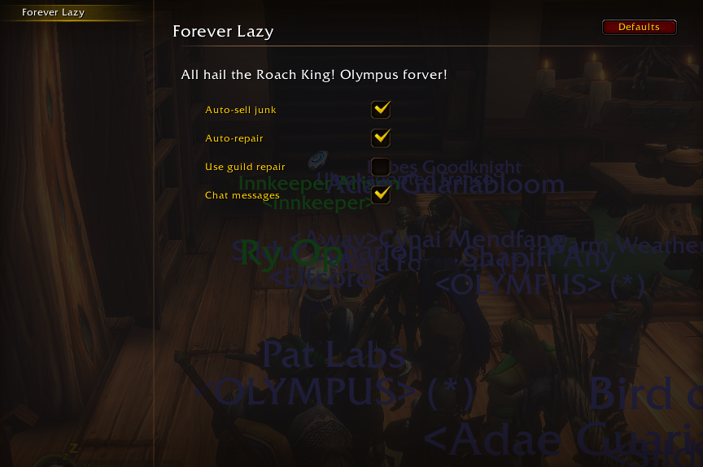

# Forever Lazy

A small Classic / Forever addon that auto-sells grey junk and auto-repairs when you open a vendor. Retail spoiled us. This covers the two things I always forget.

## How to use

Open a merchant. That is it.

Repair and junk selling are on by default. Guild repair is off — leave it that way on Forever unless you know guild repair works there.

`/fl` opens options. You can also toggle things from chat:

- `/fl sell` — auto-sell junk
- `/fl repair` — auto-repair
- `/fl guild` — guild repair
- `/fl quiet` — chat messages

`/foreverlazy` and `/lv` do the same thing.

## Install

1. Download [ForeverLazy-1.0.0.zip](https://github.com/manipulates/ForeverLazy/releases/download/v1.0.0/ForeverLazy-1.0.0.zip) from the [latest release](https://github.com/manipulates/ForeverLazy/releases/latest).
2. Extract it. You should get a folder named `ForeverLazy`.
3. Put that folder in `Interface\AddOns`.
4. Restart the game and enable **Forever Lazy** on the character select AddOns list.
